# 🎓 Student Management System

A comprehensive desktop application for managing high school academic operations — student records, teacher assignments, grading, ranking, and real-time reporting. Built with **C++17** and the **Qt 6** framework, featuring a modern dark-themed UI and an **SQLite** relational database backend.

---

## 👥 Team Members

| Name | ID |
|---|---|
| Mikiyas Hulualem | 1700915 |
| Yonatan Zeleke | 1501580 |
| Muluneh Babush | 1700928 |
| Nejat Shimels | 1700954 |

---

## ✨ Features

### 🔐 Role-Based Authentication
- **Three user roles**: Administrator, Teacher, and Student
- Secure login system with role-based access control
- Each role has a personalized dashboard and navigation sidebar
- Logout and re-login support without restarting the application

### 📊 Dashboard (Admin)
- Real-time statistics overview with card-based UI
- Displays total counts for: **Students**, **Teachers**, **Subjects**, **Sections**, **Grades**, and **Teaching Assignments**
- Auto-refreshes when navigating to the page

### 👨‍🎓 Student Management
- Full CRUD operations (Add, View, Edit, Delete)
- Advanced search by name or ID
- Filter by grade level and enrollment status (Active / Inactive / Graduated)
- Sort by ID, Name, or Class (ascending/descending)
- Bulk operations: multi-select delete and class assignment
- Automatic user account creation upon student registration
- Automatic subject enrollment based on grade and stream

### 👨‍🏫 Teacher Management
- Register new teachers with specialization (subject assignment)
- Search by name, phone, or email
- Filter by subject specialization
- Sort by ID or Name
- Bulk delete functionality
- View detailed teacher profiles with assigned subject

### 📚 Subject & Section Management
- Create subjects tied to specific grade levels and streams (Natural/Social Science)
- Create sections within grades linked to academic years
- Stream-aware subject filtering (common + stream-specific subjects)

### 📝 Teaching Assignments
- Assign teachers to specific sections and subjects
- Enforces business rules:
  - Teachers can only teach their specialized subject
  - One teacher per subject per section per year
- Year-aware assignment filtering

### 📈 Mark Entry & Grading
- Enter student marks per subject, section, and semester
- Teachers see only their assigned sections and subjects
- Year-aware mark storage (marks are tied to the section's registered academic year)
- Score validation and real-time updates

### 🏆 Ranking System
- Generate section-wide student rankings
- Calculates total score and average across all subjects
- Semester-specific ranking (Semester 1 / Semester 2)
- Admin approval workflow for finalizing rankings
- Year-aware: only shows data for the correct academic period

### 👤 Profile Pages
- Personalized profile view for all user roles
- Students see: personal info + academic placement (grade, section, stream)
- Teachers see: contact details + subject specialization
- Admins see: system administrator details
- Consistent dark-themed styling across all roles

---

## 🏗️ Architecture

### Technology Stack

| Component | Technology |
|---|---|
| Language | C++17 |
| Framework | Qt 6 (Core, GUI, Widgets, SQL) |
| Database | SQLite (via `QSqlDatabase`) |
| Build System | qmake |
| IDE | Qt Creator (recommended) |

### Project Structure

```
GUI_Mikiyas/
├── main.cpp                    # Application entry point, database setup, global theme
├── mainwindow.cpp/h            # Main window with sidebar navigation (QStackedWidget)
├── logindialog.cpp/h           # Login dialog with role-based authentication
│
├── managers/                   # Business logic & data access layer
│   ├── studentmanager.cpp/h    # Student CRUD, filtering, sorting
│   ├── usermanager.cpp/h       # User accounts & teacher management
│   ├── sectionmanager.cpp/h    # Sections, grades, academic years
│   ├── subjectmanager.cpp/h    # Subjects & teaching assignments
│   ├── markmanager.cpp/h       # Marks, ranking calculation, approvals
│   └── reportmanager.cpp/h     # Dashboard statistics aggregation
│
├── pages/                      # UI views & dialogs
│   ├── reportpage.cpp/h        # Dashboard with stat cards (admin default)
│   ├── studentpage.cpp/h       # Student list with search/filter/sort/bulk
│   ├── studentformdialog.cpp/h # Add/Edit student form dialog
│   ├── studentdetaildialog.cpp/h # Student detail view dialog
│   ├── teacherpage.cpp/h       # Teacher list management
│   ├── teacherformdialog.cpp/h # Teacher registration dialog
│   ├── teacherdetaildialog.cpp/h # Teacher detail view dialog
│   ├── coursepage.cpp/h        # Subject management page
│   ├── offeringpage.cpp/h      # Teaching assignments page
│   ├── enrollmentpage.cpp/h    # Mark entry page
│   ├── gradepage.cpp/h         # Ranking generation & approval
│   ├── assignmentdialog.cpp/h  # Assignment creation dialog
│   └── profilepage.cpp/h       # User profile page (all roles)
│
└── SchoolGUI.pro               # Qt project configuration
```

### Database Schema

The application uses an SQLite database (`school.db`) with the following tables:

```
academic_years          grade_levels            streams
sections                students                teachers
users                   subjects                teaching_assignments
homeroom_assignments    marks                   ranking_approvals
```

**Key Relationships:**
- Students belong to a **grade**, **section**, and optionally a **stream**
- Sections are linked to a **grade** and an **academic year**
- Marks are tied to a **student**, **subject**, **section**, **year**, and **semester**
- Teaching assignments connect **teachers** to **subjects** in specific **sections** per **year**

---

## 🔧 Requirements

- **Qt 6.x** (with the `sql` module)
- **C++17** compatible compiler (MinGW, MSVC, or Clang)
- **Qt Creator** (recommended IDE)

---

## 🚀 Build & Run

### Using Qt Creator (Recommended)

1. Open **Qt Creator**
2. Go to **File → Open File or Project** and select `SchoolGUI.pro`
3. Configure the project with your installed **Qt 6 kit**
4. Click **Build** (`Ctrl+B`) to compile
5. Click **Run** (`Ctrl+R`) to launch

### Using Command Line

```bash
cd GUI_Mikiyas
qmake SchoolGUI.pro
mingw32-make          # Windows (MinGW)
# or: make            # Linux/macOS
# or: nmake           # Windows (MSVC)
```

---

## 🔑 Default Login Credentials

| Role | Username | Password |
|---|---|---|
| Admin | `admin` | `admin123` |
| Teacher | `<teacher_id>` | `pass<teacher_id>` |
| Student | `<student_id>` | `pass<student_id>` |

> **Example:** A student with ID `1` would log in with username `1` and password `pass1`.

---

## 🎨 UI Design

The application features a **premium dark theme** with:

- **Color Palette**: Deep navy (`#1a1a2e`), midnight blue (`#16213e`), ocean blue (`#0f3460`), and accent red (`#e94560`)
- **Sidebar Navigation**: Role-specific menu items with active page highlighting
- **Data Tables**: Alternating row colors, colored status indicators, inline action buttons
- **Cards & Panels**: Rounded borders, subtle shadows, and grouped information
- **Responsive Layouts**: Proportional column sizing and stretch-based layouts

### 📸 Screenshots

#### 🔐 Login

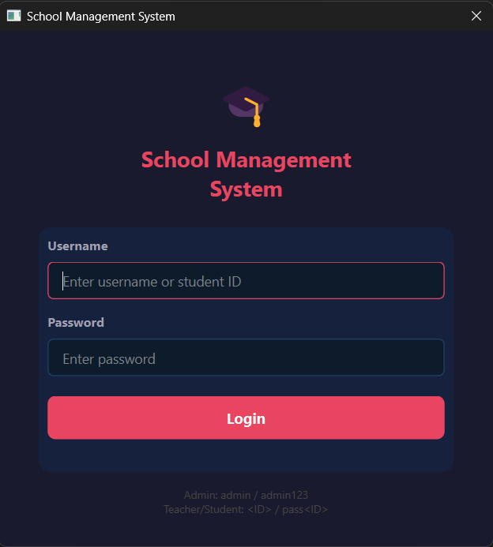

#### 🛡️ Admin Panel

| Dashboard | Student Management |
|---|---|
| 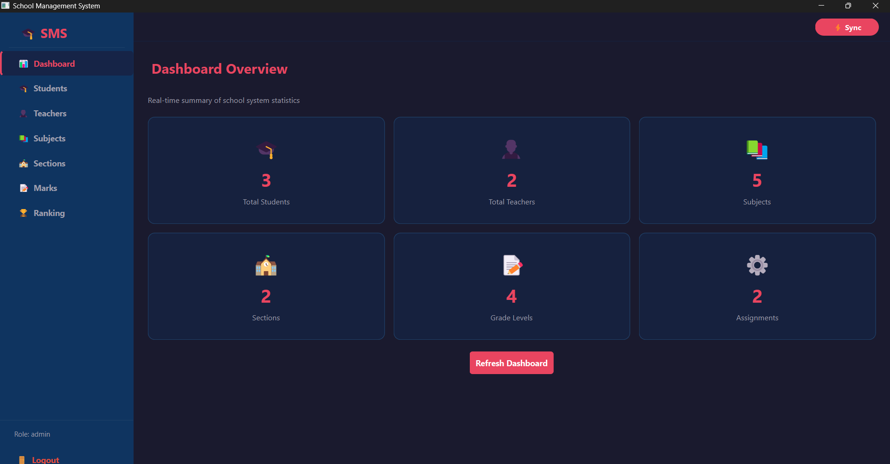 | 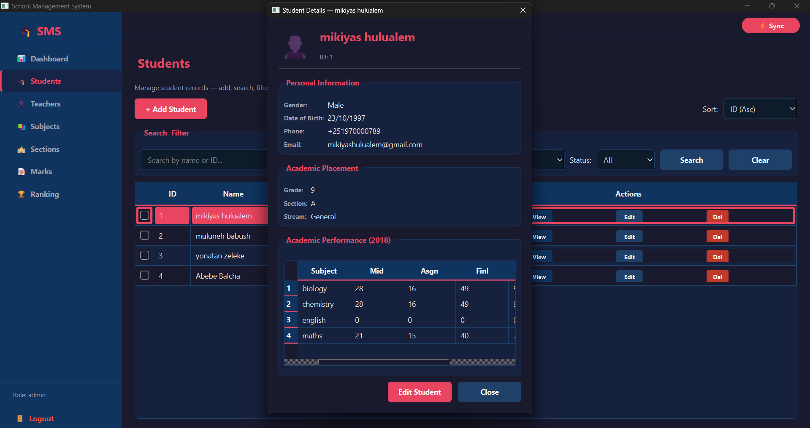 |

| Teacher Management | Subject Management |
|---|---|
| 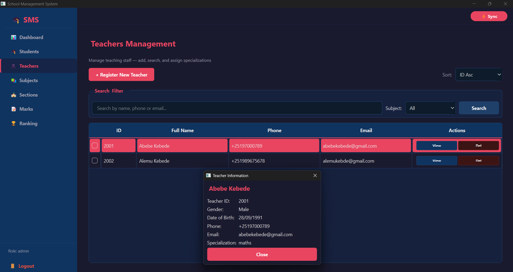 | 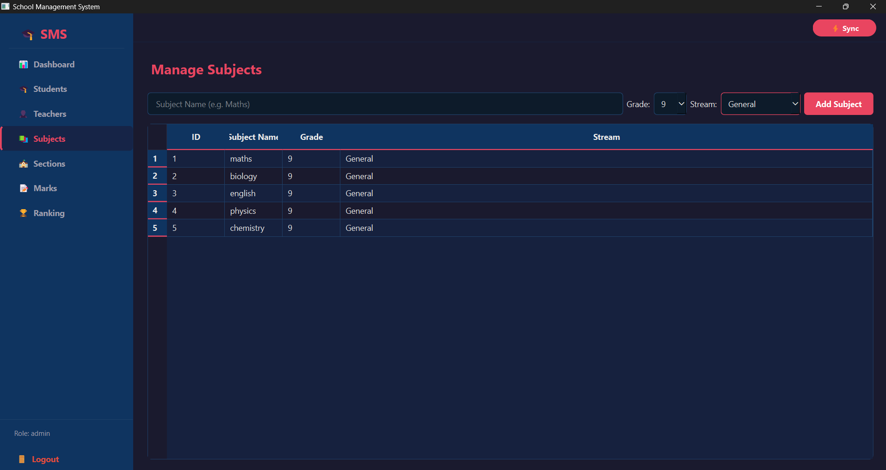 |

| Section Management | Mark Entry |
|---|---|
| 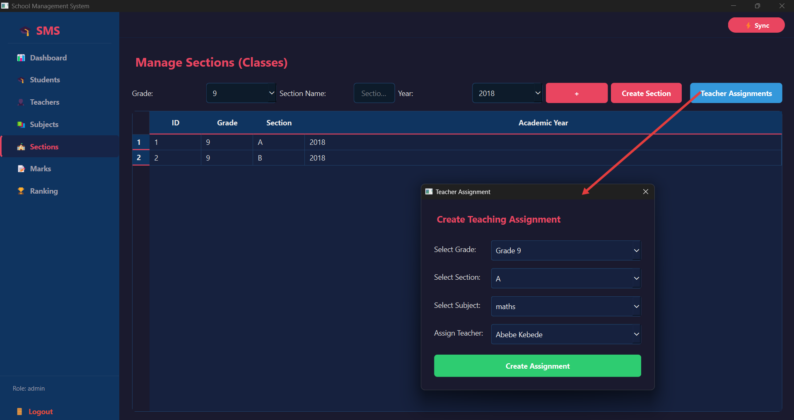 | 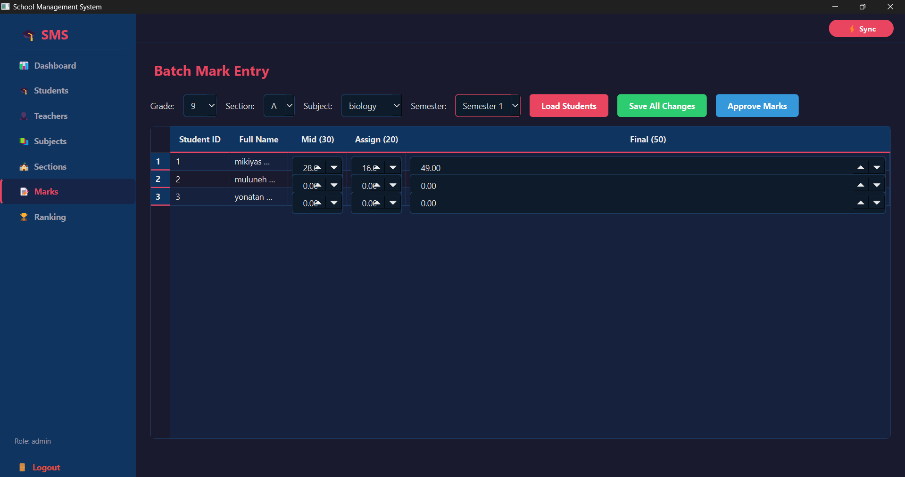 |

| Ranking |
|---|
| 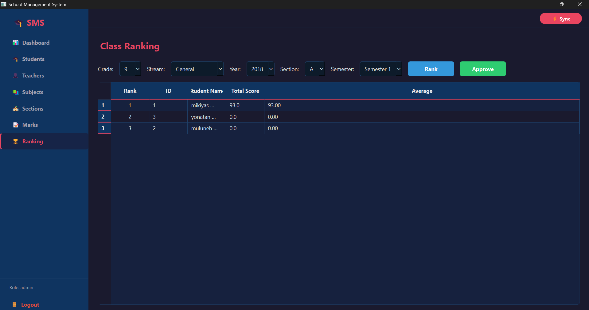 |

#### 👨‍🎓 Student Login

| Student Profile |
|---|
| 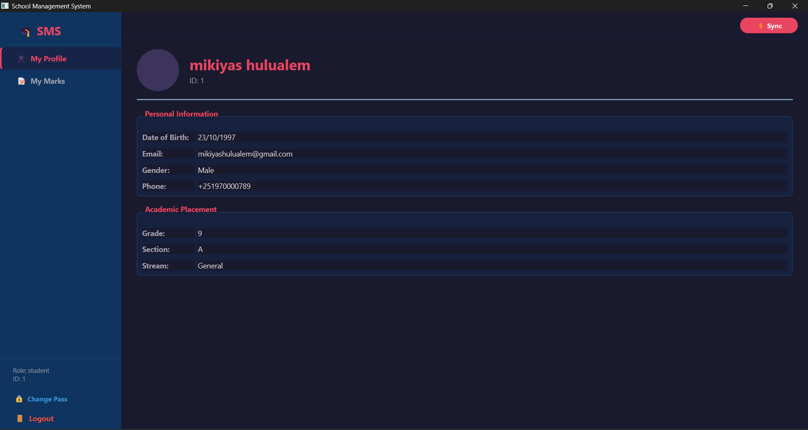 |

| Student Mark |
|---|
| 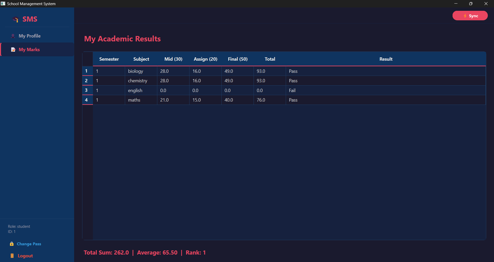 |

#### 👨‍🏫 Teacher Login
| Teacher Profile |
|---|
| 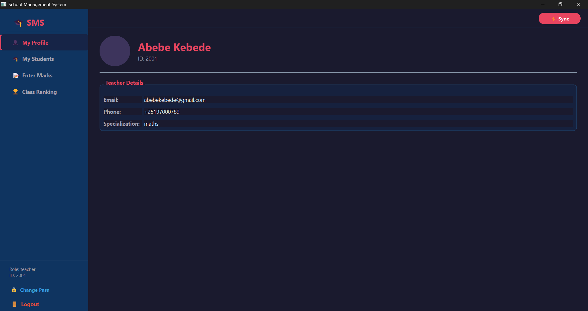 |

| Teacher Students | Teacher Marks |
|---|---|
| 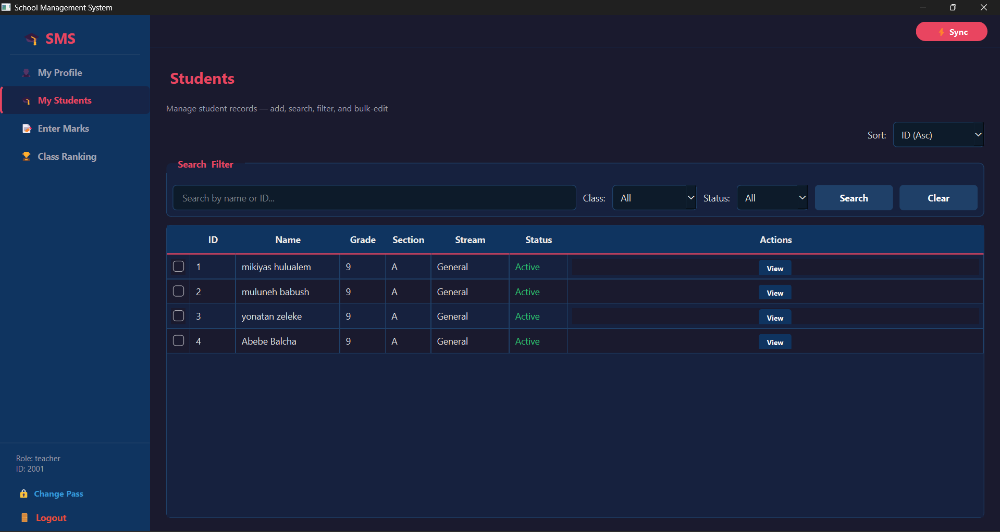 | 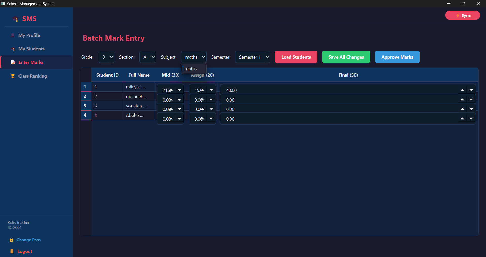 |

---

## 📋 Academic Configuration

The system is pre-configured for the **Ethiopian academic calendar**:

- **Grade Levels**: 9, 10, 11, 12
- **Streams**: Natural Science, Social Science
- **Academic Years**: 2018, 2019 (Ethiopian Calendar)
- **Semesters**: Semester 1, Semester 2

---
## 🔮 Future Improvements

- MySQL backend support
- Export reports to PDF
- Attendance management
- Notifications system
- Web-based version
- Cloud synchronization
## 📄 License

This project was developed as an academic assignment. All rights reserved by the team members listed above.
